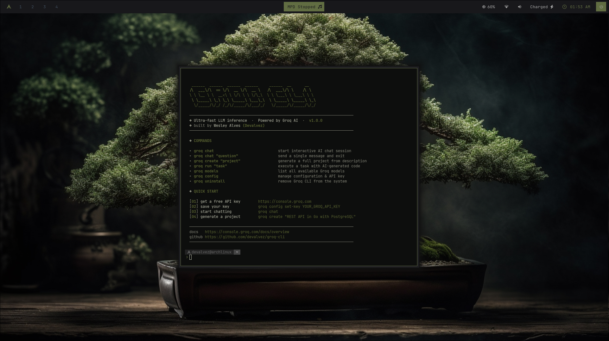

<div align="center">

```
   ______  ______  ______  ______     ______  __      __
  /\  ___\/\  == \/\  __ \/\  __ \   /\  ___\/\ \    /\ \
  \ \ \__ \ \  __<\ \ \/\ \ \ \/\_\  \ \ \___\ \ \___\ \ \
   \ \_____\ \_\ \_\ \_____\ \___\_\  \ \_____\ \_____\ \_\
    \/_____/\/_/ /_/\/_____/\/___/_/   \/_____/\/_____/\/_/
```

**Terminal CLI powered by [Groq AI](https://console.groq.com) — ultra-fast LLM inference, project generation and task execution right in your shell.**

[](https://go.dev)
[](LICENSE)
[](https://console.groq.com)

*Built by **Wesley Alves** ([Devalvez](https://github.com/devalvez))*
</div>

<div align="center" style="margin-top: 50px;">
  
</div>

---

## Índice

- [Funcionalidades](#funcionalidades)
- [Pré-requisitos](#pré-requisitos)
- [Instalando dependências](#instalando-dependências)
  - [Go (obrigatório)](#go-obrigatório)
  - [Clipboard (opcional)](#clipboard-opcional)
- [Instalação](#instalação)
  - [Script automático](#script-automático-recomendado)
  - [Build manual](#build-manual)
  - [Testando sem instalar](#testando-sem-instalar)
- [Configuração inicial](#configuração-inicial)
- [Comandos](#comandos)
  - [groq](#groq--tela-de-boas-vindas)
  - [groq chat](#groq-chat--conversa-com-ia)
  - [groq create](#groq-create--gerador-de-projetos)
  - [groq run](#groq-run--executor-de-tarefas)
  - [groq models](#groq-models--listar-modelos)
  - [groq config](#groq-config--configuração)
  - [groq uninstall](#groq-uninstall--desinstalar)
- [Flags globais](#flags-globais)
- [Modelos disponíveis](#modelos-disponíveis)
- [Estrutura do projeto](#estrutura-do-projeto)
- [Desinstalação](#desinstalação)
- [Preview da interface](#preview-da-interface)
- [Licença](#licença)

---

## Funcionalidades

| | Funcionalidade | Descrição |
|---|---|---|
| 💬 | **Chat interativo** | Sessões multi-turno com contexto preservado |
| 💬 | **Chat direto** | Envie uma pergunta e receba a resposta imediatamente |
| 📋 | **Saída plain** | Resposta em texto puro, sem bordas — ideal para pipes |
| 📋 | **Copiar para clipboard** | Copia a resposta limpa direto para `Ctrl+V` |
| 🚀 | **Gerador de projetos** | Cria estrutura completa de arquivos a partir de uma descrição |
| ⚡ | **Executor de tarefas** | Gera e executa código para realizar tarefas em linguagem natural |
| 📋 | **Listagem de modelos** | Exibe todos os modelos Groq disponíveis via API |
| ⚙️ | **Gerenciamento de config** | API key, modelo padrão e configurações persistentes |
| 🗑 | **Desinstalador** | Remove o CLI do sistema com um único comando |
| 🎨 | **Interface visual** | UI dark com ícones geométricos, cores mint-green e word-wrap automático |

---

## Pré-requisitos

- Sistema operacional **Linux** ou **macOS**
- **Go 1.21** ou superior
- Uma **API key gratuita** do Groq → [console.groq.com](https://console.groq.com)

---

## Instalando dependências

### Go (obrigatório)

#### Ubuntu / Debian

```bash
# Opção 1 — via apt (versão do repositório)
sudo apt update
sudo apt install -y golang-go

# Verificar versão
go version
```

```bash
# Opção 2 — versão mais recente direto do site (recomendado)
# Substitua "1.22.0" pela versão mais recente em https://go.dev/dl/
wget https://go.dev/dl/go1.22.0.linux-amd64.tar.gz
sudo rm -rf /usr/local/go
sudo tar -C /usr/local -xzf go1.22.0.linux-amd64.tar.gz

# Adicionar ao PATH (adicione ao ~/.bashrc ou ~/.zshrc)
echo 'export PATH=$PATH:/usr/local/go/bin' >> ~/.bashrc
source ~/.bashrc

# Verificar
go version
```

#### Fedora / RHEL / CentOS

```bash
sudo dnf install -y golang

# Verificar
go version
```

#### Arch Linux / Manjaro

```bash
sudo pacman -S go

# Verificar
go version
```

#### openSUSE

```bash
sudo zypper install go

# Verificar
go version
```

#### macOS

```bash
# Via Homebrew
brew install go

# Verificar
go version
```

---

### Clipboard (opcional)

Necessário apenas para o flag `--copy` do comando `groq chat --copy`.

#### Ubuntu / Debian

```bash
# X11
sudo apt install -y xclip

# Wayland
sudo apt install -y wl-clipboard
```

#### Fedora

```bash
# X11
sudo dnf install -y xclip

# Wayland
sudo dnf install -y wl-clipboard
```

#### Arch Linux

```bash
# X11
sudo pacman -S xclip

# Wayland
sudo pacman -S wl-clipboard
```

#### macOS

```bash
# pbcopy já vem instalado por padrão no macOS — nenhuma ação necessária
```

> O CLI detecta automaticamente qual ferramenta está disponível na seguinte ordem de prioridade: `xclip` → `xsel` → `wl-copy` → `pbcopy`.

---

## Instalação

### Script automático (recomendado)

```bash
# 1. Clone o repositório
git clone https://github.com/devalvez/groq-CLI.git
cd groq-cli

# 2. Dê permissão de execução ao instalador
chmod +x install.sh

# 3. Execute o instalador
./install.sh
```

O script verifica se o Go está instalado, baixa as dependências, compila e move o binário para `/usr/local/bin/groq`.

---

### Build manual

```bash
# Entrar na pasta do projeto
cd groq-cli

# Baixar dependências
go mod tidy

# Compilar
go build -ldflags="-s -w" -o groq .

# Instalar globalmente (requer sudo)
sudo mv groq /usr/local/bin/

# Verificar
groq --version
```

Ou via Makefile:

```bash
make          # apenas compila → ./groq
make install  # compila + instala em /usr/local/bin
make clean    # remove o binário local
make build-all  # compila para linux/amd64, linux/arm64, darwin
```

---

### Testando sem instalar

Você pode testar sem mover o binário para nenhum lugar do sistema:

```bash
# Opção 1 — rodar direto com go run (sem compilar)
go mod tidy
go run . chat "Olá!"

# Opção 2 — compilar e rodar local
go build -o groq .
./groq
./groq chat "Explique goroutines"

# Opção 3 — Docker (sem precisar do Go na máquina)
docker build -t groq-cli .
docker run -it -e GROQ_API_KEY=sua_chave groq-cli
docker run -it -e GROQ_API_KEY=sua_chave groq-cli chat "Olá"
```

---

## Configuração inicial

### 1. Obter a API key

Acesse [console.groq.com](https://console.groq.com), crie uma conta gratuita e gere uma API key.

### 2. Configurar a API key

```bash
# Opção A — salvar no arquivo de configuração (persiste entre sessões)
groq config set-key gsk_xxxxxxxxxxxxxxxxxxxxxxxx

# Opção B — variável de ambiente (válida apenas na sessão atual)
export GROQ_API_KEY=gsk_xxxxxxxxxxxxxxxxxxxxxxxx

# Para tornar permanente, adicione ao ~/.bashrc ou ~/.zshrc
echo 'export GROQ_API_KEY=gsk_xxxxxxxxxxxxxxxxxxxxxxxx' >> ~/.bashrc
source ~/.bashrc
```

> A variável de ambiente `GROQ_API_KEY` tem prioridade sobre o valor salvo no arquivo de configuração.

---

## Comandos

### `groq` — Tela de boas-vindas

```bash
groq
```

Exibe a logo ASCII, lista todos os comandos disponíveis e o guia de início rápido.

---

### `groq chat` — Conversa com IA

#### Sessão interativa

```bash
groq chat
```

Abre uma sessão multi-turno. O modelo mantém o contexto de toda a conversa. Encerre com `/exit`.

#### Pergunta rápida (single-shot)

```bash
groq chat "O que é uma interface em Go?"
groq chat "Escreva um Dockerfile para uma aplicação Node.js"
```

#### Flags disponíveis

| Flag | Atalho | Padrão | Descrição |
|---|---|---|---|
| `--model` | `-m` | config | Modelo Groq a usar |
| `--max-tokens` | `-t` | `8192` | Limite de tokens na resposta |
| `--temperature` | `-T` | `0.7` | Criatividade (0.0 = determinístico, 2.0 = máximo) |
| `--plain` | | `false` | Saída em texto puro, sem bordas ou cores |
| `--copy` | | `false` | Copia a resposta para o clipboard |

> `--plain` e `--copy` são mutuamente exclusivos.

#### Exemplos com flags

```bash
# Usar um modelo específico
groq chat --model llama3-70b-8192 "Explique recursão"
groq chat -m mixtral-8x7b-32768 "Resuma este conceito longo..."

# Saída plain — ideal para pipes e redirecionamentos
groq chat --plain "liste 10 comandos úteis do git"
groq chat --plain "escreva um .gitignore para Go" > .gitignore
groq chat --plain "corrija este JSON: {foo: bar}" | python3 -m json.tool

# Copiar resposta para clipboard (sem caracteres de borda)
groq chat --copy "escreva um README para meu projeto"
groq chat --copy "traduza este texto para inglês: Olá mundo"

# Combinar flags
groq chat --plain --model llama3-8b-8192 "resposta rápida"
groq chat --plain "lista de países" | grep Brasil
groq chat --plain "script de backup em bash" | tee backup.sh
```

#### Comandos dentro da sessão interativa

| Comando | Descrição |
|---|---|
| `/exit` ou `/quit` ou `/q` | Encerra a sessão |
| `/clear` | Limpa o histórico e a tela |
| `/model <id>` | Troca de modelo sem sair da sessão |
| `/help` | Exibe os comandos disponíveis |

---

### `groq create` — Gerador de projetos

Gera a estrutura completa de um projeto (arquivos, código, dependências, README) a partir de uma descrição em linguagem natural.

```bash
groq create "<descrição do projeto>"
```

#### Flags disponíveis

| Flag | Atalho | Padrão | Descrição |
|---|---|---|---|
| `--dir` | `-d` | derivado da descrição | Diretório de saída |
| `--dry-run` | `-n` | `false` | Mostra o que seria criado sem escrever nada |
| `--execute` | `-e` | `false` | Executa o projeto logo após criar |
| `--model` | `-m` | config | Modelo a usar para geração |

#### Exemplos

```bash
# Projetos backend
groq create "API REST em Go com PostgreSQL e autenticação JWT"
groq create "servidor gRPC em Go com TLS"
groq create "microsserviço em Python com FastAPI e Redis"

# Projetos frontend
groq create "app React com TypeScript, Tailwind e dark mode"
groq create "landing page em HTML e CSS com animações"

# Scripts e ferramentas
groq create "CLI em Go para gerenciar tarefas locais"
groq create "scraper em Python com BeautifulSoup e exportação CSV"

# Com diretório customizado
groq create "API Node.js com Express e MongoDB" --dir ./minha-api

# Simular sem criar os arquivos
groq create "app Flutter para lista de tarefas" --dry-run

# Criar e executar imediatamente
groq create "servidor HTTP simples em Go" --execute
```

---

### `groq run` — Executor de tarefas

Descreva uma tarefa em linguagem natural. O CLI usa a IA para gerar o código necessário, exibe para revisão (modo seguro) e executa.

```bash
groq run "<descrição da tarefa>"
```

#### Flags disponíveis

| Flag | Atalho | Padrão | Descrição |
|---|---|---|---|
| `--lang` | `-l` | automático | Linguagem preferida (`bash`, `python`, `go`, `node`) |
| `--safe` | | `true` | Exibe o código antes de executar e pede confirmação |
| `--show-code` | | `false` | Sempre exibe o código gerado |
| `--model` | `-m` | config | Modelo a usar |

#### Exemplos

```bash
# Operações de arquivo e sistema
groq run "listar todos os arquivos .log maiores que 10MB"
groq run "encontrar arquivos duplicados no diretório atual"
groq run "renomear todos os .jpeg para .jpg nesta pasta"
groq run "comprimir arquivos .log com mais de 7 dias"

# Monitoramento
groq run "monitorar uso de CPU e memória a cada 3 segundos"
groq run "exibir as 10 conexões de rede mais ativas"

# Dados e processamento
groq run "gerar 100 registros de usuários falsos em JSON"
groq run "converter este CSV em JSON"
groq run --lang python "calcular os primeiros 20 números de Fibonacci"
groq run --lang python "plotar um gráfico de barras com dados do stdin"

# Rede
groq run "testar latência dos DNS 1.1.1.1 e 8.8.8.8 e comparar"
groq run --lang python "buscar a previsão do tempo para São Paulo"

# Com linguagem forçada
groq run --lang bash "script de backup incremental com rsync"
groq run --lang node "servidor HTTP simples na porta 8080"

# Ver código antes de executar
groq run --show-code "deletar arquivos temporários do sistema"
```

> Por padrão `--safe=true`: o código é sempre exibido e requer confirmação antes de executar. Para desabilitar: `--safe=false`.

---

### `groq models` — Listar modelos

```bash
groq models
```

Exibe todos os modelos disponíveis na sua conta Groq com ID e provedor. Use o ID com a flag `--model` em qualquer comando.

---

### `groq config` — Configuração

```bash
# Exibir configuração atual
groq config
groq config show

# Definir API key
groq config set-key gsk_xxxxxxxxxxxxxxxxxxxxxxxx

# Definir modelo padrão
groq config set-model llama-3.3-70b-versatile

# Restaurar configurações padrão
groq config reset
```

#### Subcomandos

| Subcomando | Descrição |
|---|---|
| `groq config` | Exibe a configuração atual |
| `groq config show` | Igual ao comando acima |
| `groq config set-key <key>` | Salva a API key |
| `groq config set-model <id>` | Define o modelo padrão |
| `groq config reset` | Restaura os padrões |

O arquivo de configuração fica em:

```
~/.config/groq-cli/config.json
```

---

### `groq uninstall` — Desinstalar

```bash
# Desinstalação interativa (recomendado)
groq uninstall

# Manter o arquivo de configuração e API key
groq uninstall --keep-config

# Pular confirmações (útil em scripts)
groq uninstall --force
groq uninstall --force --keep-config
```

| Flag | Descrição |
|---|---|
| `--keep-config` | Remove o binário mas preserva `~/.config/groq-cli/` |
| `--force` / `-f` | Pula todas as confirmações |

Alternativamente, use o script externo (útil se o binário não estiver funcionando):

```bash
chmod +x uninstall.sh
./uninstall.sh
```

---

## Flags globais

Estas flags funcionam em **qualquer** comando:

| Flag | Descrição |
|---|---|
| `--model <id>` | Sobrescreve o modelo padrão para este comando |
| `--no-color` | Desabilita cores na saída |
| `--help` / `-h` | Exibe ajuda do comando |

---

## Modelos disponíveis

Execute `groq models` para ver a lista atualizada. Modelos principais:

| Modelo | Contexto | Ideal para |
|---|---|---|
| `llama-3.3-70b-versatile` | 128K | Uso geral — **padrão** |
| `llama3-70b-8192` | 8K | Rápido e capaz |
| `llama3-8b-8192` | 8K | Respostas ultra-rápidas |
| `llama-3.1-70b-versatile` | 128K | Contexto longo |
| `mixtral-8x7b-32768` | 32K | Documentos longos |
| `gemma2-9b-it` | 8K | Seguimento de instruções |
| `deepseek-r1-distill-llama-70b` | 128K | Raciocínio e código |

---

## Estrutura do projeto

```
groq-cli/
│
├── main.go                          # Entry point
├── go.mod                           # Dependências Go
├── Makefile                         # Scripts de build
├── install.sh                       # Instalador automático
├── uninstall.sh                     # Desinstalador externo
├── README.md                        # Esta documentação
├── groq-cli-preview.html            # Preview visual da interface
│
├── cmd/                             # Comandos cobra
│   ├── root.go                      # Comando raiz + tela de boas-vindas
│   ├── chat.go                      # groq chat + groq models
│   ├── create.go                    # groq create
│   ├── run.go                       # groq run
│   ├── config.go                    # groq config
│   └── uninstall.go                 # groq uninstall
│
└── internal/                        # Pacotes internos
    ├── clipboard/
    │   └── clipboard.go             # Integração com xclip / xsel / wl-copy
    │
    ├── config/
    │   └── config.go                # Leitura e escrita de ~/.config/groq-cli/
    │
    ├── executor/
    │   └── executor.go              # Geração e execução de código via IA
    │
    ├── groq/
    │   └── client.go                # Cliente HTTP da API Groq (stream + models)
    │
    └── ui/
        ├── ui.go                    # Logo, cores, helpers globais
        ├── chat.go                  # Interface do chat e modos de saída
        ├── config.go                # Exibição de configurações e modelos
        ├── mode.go                  # Tipos OutputMode (Default/Plain/Copy)
        ├── project.go               # Interface do gerador de projetos
        └── wrap.go                  # Motor de word-wrap para o terminal
```

---

## Desinstalação

```bash
# Via comando do CLI
groq uninstall

# Via script (se o CLI não estiver disponível)
./uninstall.sh

# Manual
sudo rm /usr/local/bin/groq
rm -rf ~/.config/groq-cli
```

---

## Preview da interface

Abra o arquivo `groq-cli-preview.html` no seu navegador para ver uma demonstração visual da interface com exemplos reais de cada tela:

```bash
# Linux
xdg-open index.html

# macOS
open index.html
```

Ou acesse diretamente pelo gerenciador de arquivos clicando duas vezes no arquivo `groq-cli-preview.html` na raiz do projeto.

A preview contém quatro abas interativas:

| Aba | Conteúdo |
|---|---|
| **Chat** | Sessão de chat com bubble de usuário e resposta da IA |
| **Resposta Longa** | Demonstração do word-wrap automático em respostas extensas |
| **Create** | Fluxo completo de geração de projeto |
| **Welcome** | Tela de boas-vindas com logo e créditos |

---

## Licença

MIT — veja [LICENSE](LICENSE) para detalhes.

---

<div align="center">

Built with ♥ by **Wesley Alves** ([Devalvez](https://github.com/devalvez))

[console.groq.com](https://console.groq.com) · [Documentação da API](https://console.groq.com/docs/overview)

</div>
